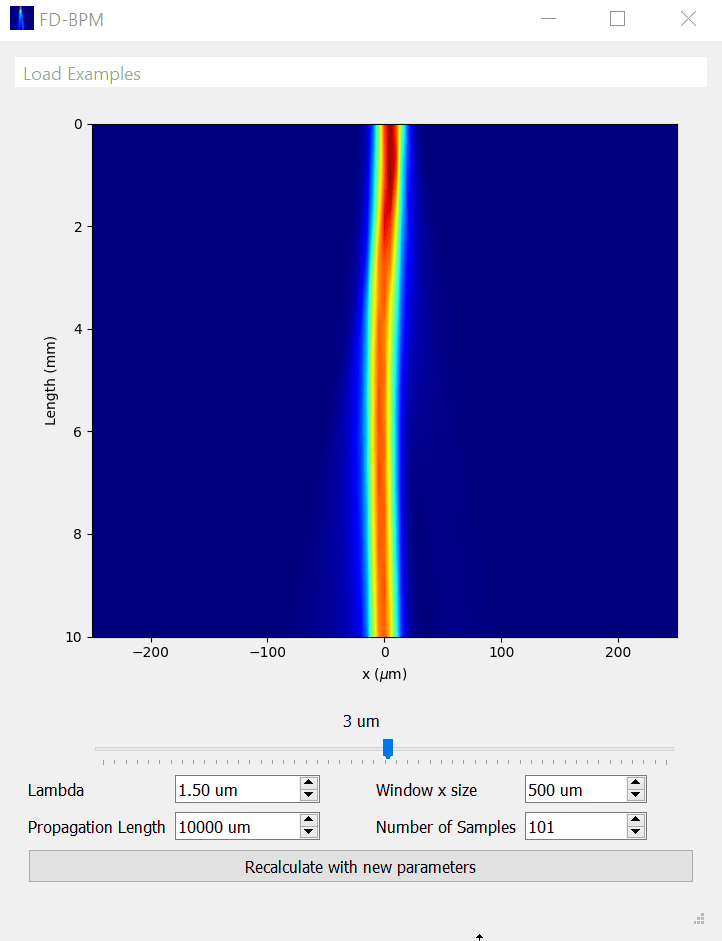

# FD-BPM

This repo contains scripts that calculate the propagation of light through different refractive index variations. It is based on Finite Difference Beam Propagation Method.

- Execute main GUI window with:

```
python fdbpm.py
```

Two `.pdf` files present in the repo with slides and a more extensive report explain the theory and how the scripts were developed.


## Example:

