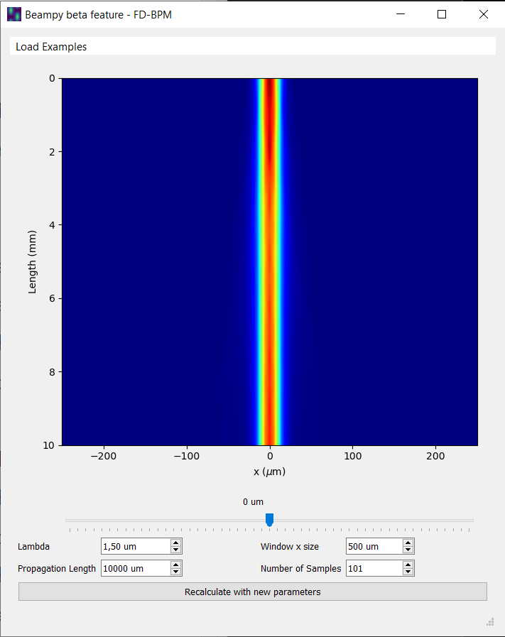

# FD-BPM

This repo contains scripts that calculate the propagation of light through different refractive indices' variation. It is based on Finite Difference Beam Propagation Method.

Execute main GUI window with:

```
python fdbpm.py
```


## Example:

